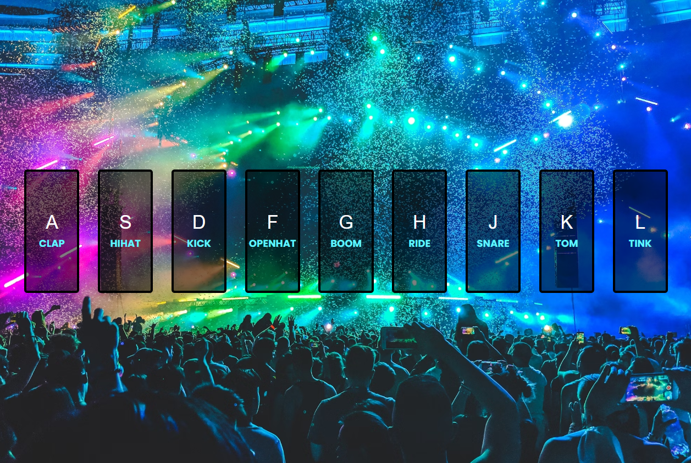

# Interactive Drum Kit

A responsive drum kit web app that allows users to play drum sounds using their keyboard or mouse. This project was created as part of the JavaScript30 course and showcases an interactive interface for music lovers.

## Description

This project provides an interactive drum kit where users can play different drum sounds either by pressing specific keys on the keyboard or by clicking on on-screen buttons. Each key plays a unique sound, and when a sound is played, a visual effect is applied to the corresponding key. The app is designed to be responsive, adjusting seamlessly to various screen sizes, from mobile to desktop devices. It leverages HTML, CSS, and JavaScript to create an engaging and fun musical experience.

## Features

- Interactive buttons and keyboard controls to play drum sounds.
- Responsive design that adapts to different screen sizes (mobile, tablet, and desktop).
- Visual effects when a key is pressed, including scaling and box-shadow for a dynamic feel.
- Simple, modern layout with CSS Flexbox for easy alignment and positioning.
- Sound effects triggered by both keyboard keys and mouse clicks.
- Reusable and efficient JavaScript code for adding functionality to the keys.

## Technologies Used

- HTML
- CSS
- JavaScript

## How to Run

1. Clone the repository to your local machine.
2. Open `index.html` in your web browser.
3. Alternatively, you can view the live project on GitHub Pages: [Interactive Drum Kit on GitHub Pages](https://deannamandarino.github.io/drum-kit/).

## Acknowledgments

This project was completed as part of the JavaScript30 course. Special thanks to Wes Bos for the excellent resources and guidance throughout the course.